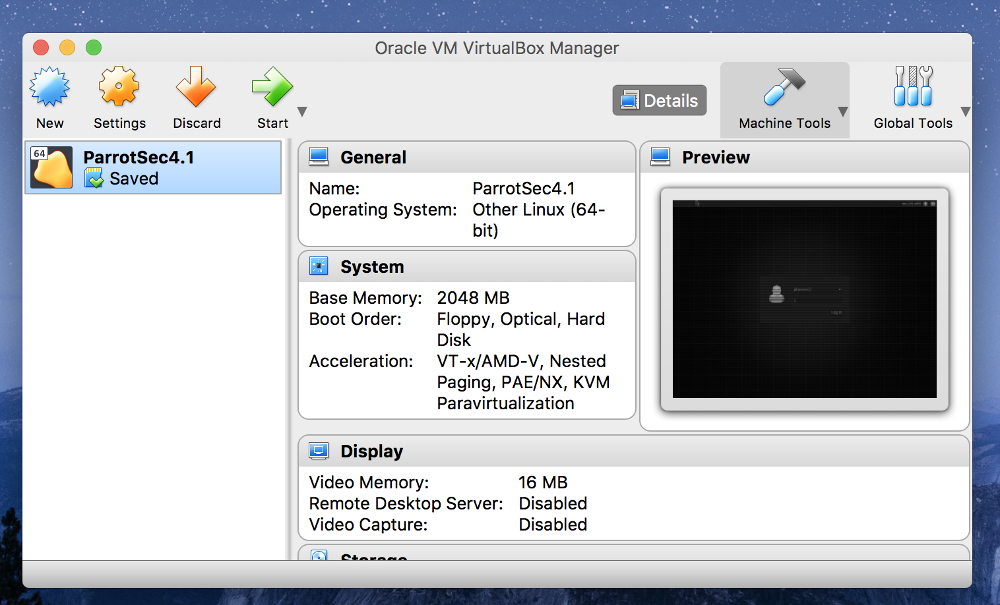
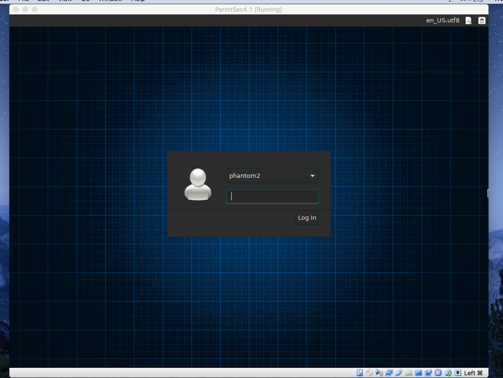
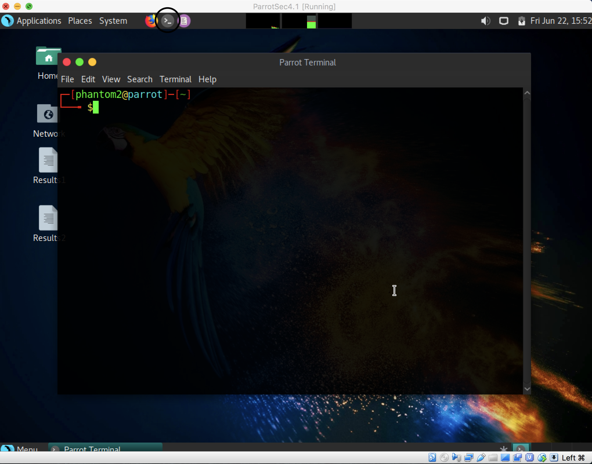

<!DOCTYPE html>
<html>
<link rel="stylesheet" href="style.css">
<title>Ethical Hack</title>

  <head>
    
    <ul>
      <li><a class="active" href="#home">Home</a></li>
      <li><a href="#contact">Contact</a></li>
      <li><a href="#about">About</a></li>
    </ul>
    

      
      <h1>Ethical Hacking for Beginners:</h1>
    

    

      

        <h4 id="warning">Once again a disclamer, this Ethical Hack website is only to teach people for educational purposes not for selfish purposes. I am not responsible for your actions you do.</h4>
      

    

    

      <h4 id= "color">Ethical Hacking: the act of locating weaknesses and vulnerabilities of computer and information systems by duplicating the intent and actions of malicious hackers.</h4>
    

    <h4 id= "need"> So now you know the definition lets start up Parrot Os: </h4>
  </head>
  <body>
    

      <h4 id="color">1.)First you will have needed to download and install VirtualBox for Windows or Mac
    

    

      
    

    

      <h4 id="color">2.)Also make sure that you have Parrot os added or installed in VirtualBox
    

    

      
    

    

      If you don't have VirtualBox click the Video link to see a video on how to install VirtualBox and how to add Parrot os, but you should have Parrot os downloaded by clicking on the Parrotos link
    

    

       <button><a href="https://www.youtube.com/watch?v=qEigAIWBIQI&t=350s"target="_blank">Video</a></button>
      <button><a href="https://sourceforge.net/projects/parrotsecurity/"target="_blank">ParrotOs</a></button>
    

    

      <h4 id="color">3.)Now that VirtualBox is opened press the green arrow to start parrot os
    

    

      
    

      <h4 id="color">4.)Log in to your application and once you have entered start up your terminal
    

    

      
      
  </body>
</html>
